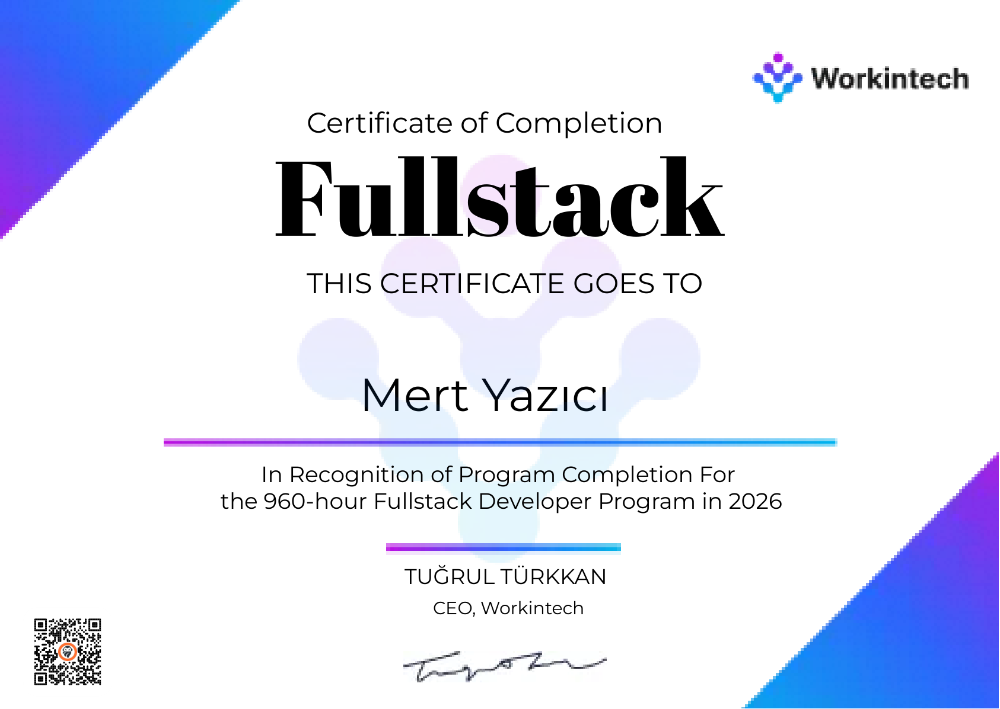
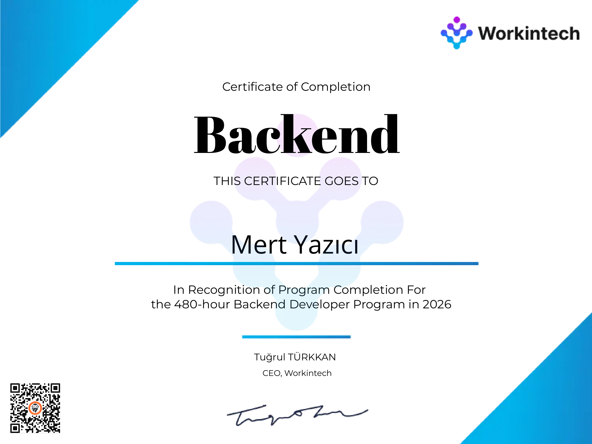

<div align="center">

# Mert Yazıcı

### Senior Full-Stack Engineer · AI Systems Builder

*Designing and shipping enterprise APIs, AI assistants and integration platforms end-to-end.*

<br/>

<a href="https://mertyazici.net"></a>&nbsp;
<a href="https://linkedin.com/in/yzcmert"></a>&nbsp;
<a href="mailto:yzc.mert@icloud.com"></a>

</div>

<br/>

## About

- **System Architect & Full-Stack Engineer** at **Probiz Yazılım** — Kocaeli, Turkey
- **5+ years** of hands-on engineering, **50+ projects** shipped to production
- Focus areas: **Enterprise APIs · AI/RAG systems · ERP platforms · Process automation**
- Currently building **self-hosted AI assistants** and **enterprise integration platforms** used daily across manufacturing companies
- Industrial Engineering background (Balıkesir University) — I approach software as a system: constraints, throughput, failure modes first

```ts
const principles = [
  "Production is the only benchmark that matters",
  "Boring, observable architecture beats clever architecture",
  "Automate the second time, not the tenth",
];
```

<br/>

## Tech Stack

<div align="center">

<table>
<tr>
<td align="center" width="25%">

**BACKEND**


</td>
<td align="center" width="25%">

**FRONTEND**


</td>
<td align="center" width="25%">

**AI / DATA**


</td>
<td align="center" width="25%">

**INFRA**


</td>
</tr>
</table>

</div>

<br/>

## Featured Work

<table>
<tr>
<td width="50%" valign="top">

### AI.PROKA — Self-Hosted Enterprise AI Assistant

`.NET 8` `React` `Ollama` `RAG` `Dapper`

Hybrid retrieval engine (BM25 + cosine similarity + RRF fusion) over 500+ corporate documents. Streaming, context-aware answers served fully on-premise — no data leaves the company network.

</td>
<td width="50%" valign="top">

### ProEntegrator — Enterprise Integration Platform

`.NET 8` `React` `TypeScript` `SQL Server`

ERP-to-mobile bridge with 38+ API endpoints. Modular architecture unifying production, inventory, sales and HR data flows for daily operational use.

</td>
</tr>
<tr>
<td width="50%" valign="top">

### Real Estate CRM Automation

`C#` `WPF` `.NET 8` `Selenium`

Industry-specific CRM automation: listing collection, client matching and communication workflows orchestrated across multiple platforms.

</td>
<td width="50%" valign="top">

### Marketplace Sync Suite

`C#` `WPF` `.NET 8` `PostgreSQL`

Desktop application synchronizing stock, pricing and order management across multiple e-commerce platforms from a single control point.

</td>
</tr>
</table>

<div align="center">
<br/>
<a href="https://mertyazici.net"></a>
</div>

<br/>

## Certifications

<table>
<tr>
<td width="50%" align="center" valign="top">



**Fullstack Developer Program — 960 hours**<br/>
Workintech · 2026

</td>
<td width="50%" align="center" valign="top">



**Backend Developer Program — 480 hours**<br/>
Workintech · 2026

</td>
</tr>
</table>

<br/>

## GitHub Metrics

<div align="center">


&nbsp;&nbsp;


</div>

<br/>

## Contact

Open to senior engineering roles, architecture consulting and challenging integration problems.

**Portfolio:** [mertyazici.net](https://mertyazici.net) · **LinkedIn:** [/in/yzcmert](https://linkedin.com/in/yzcmert) · **Email:** [yzc.mert@icloud.com](mailto:yzc.mert@icloud.com)
